## Introduction

The Bayesian viewpoint is a highly instructive way to think about machine learning (and intelligence in general). A Gaussian process (GP) is perhaps one of the most elegant machine learning methods, providing a way to perform Bayesian inference over functions, and you can condition on how these functions should behave to obtain a posterior process. Powerful, it might be, but the mathematics works out nicely only in the linear/Gaussian regime, where the distributions are conjugate. For example, regression is easy, while classification (where the functions typically map to probabilities) is substantially harder, requiring more advanced methods such as the Laplace approximation, variational inference, or MCMC.

I recently came across a nice paper by Moss et al. (2026) that shows how to condition a GP on nearly any event that can be encoded as a PDF. For example, you can constrain the functions to be positive, monotone, or convex, or to satisfy a differential equation. They call their framework FLOWGP, as it is based on stochastic flow models. Their conditioning framework includes a method for sampling from a prior GP and conditioning on both the data D (traditional linear-Gaussian constraints) and the nonlinear, non-Gaussian likelihoods C. 

Let us explore here how and whether this works. A notebook with the code can be found on [PlutoLand](https://pluto.land/n/rkxrmlcw).

## Gaussian process crash course

A GP is rather simple: it is a stochastic process in which any finite set of point evaluations follows a multivariate normal (MVN) distribution. Practically, one can define a GP prior distribution by specifying a mean function $m(x)$[^1] and a positive definite covariance or kernel function $k(x,x')$, which determines the correlation between the points (or the variance via $k(x,x)$).

For example, we define a simple radial basis kernel for smooth, nonlinear functions. 

```julia
k(x, y; γ=1.0, degree=2, A=1) = A*exp(-norm(x .- y)^degree/γ^2)
```

These are evaluated on a range of points to build the covariance matrix. 

```julia
K = [k(x, y, A=1) for x in xsteps, y in xsteps] + 1e-10I
```

```
K
201×201 Matrix{Float64}:
 1.0          0.997503     0.99005      …  2.72143e-43  1.0087e-43   3.72008e-44
 0.997503     1.0          0.997503        7.30573e-43  2.72143e-43  1.0087e-43
 0.99005      0.997503     1.0             1.95145e-42  7.30573e-43  2.72143e-43
 0.977751     0.99005      0.997503        5.18658e-42  1.95145e-42  7.30573e-43
 0.960789     0.977751     0.99005         1.37161e-41  5.18658e-42  1.95145e-42
 0.939413     0.960789     0.977751     …  3.60921e-41  1.37161e-41  5.18658e-42
 0.913931     0.939413     0.960789        9.44975e-41  3.60921e-41  1.37161e-41
 ⋮                                      ⋱                            ⋮
 5.18658e-42  1.37161e-41  3.60921e-41  …  0.977751     0.960789     0.939413
 1.95145e-42  5.18658e-42  1.37161e-41     0.99005      0.977751     0.960789
 7.30573e-43  1.95145e-42  5.18658e-42     0.997503     0.99005      0.977751
 2.72143e-43  7.30573e-43  1.95145e-42     1.0          0.997503     0.99005
 1.0087e-43   2.72143e-43  7.30573e-43     0.997503     1.0          0.997503
 3.72008e-44  1.0087e-43   2.72143e-43  …  0.99005      0.997503     1.0
 ```

 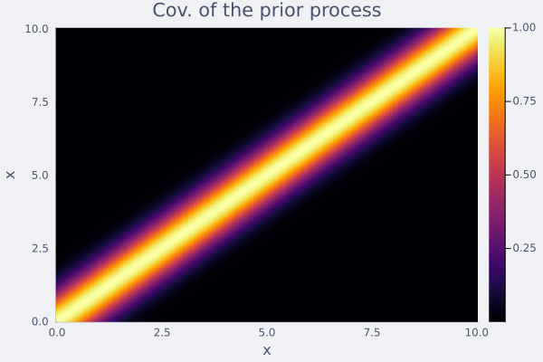


This suffices for defining a GP, from which we can easily sample from the prior distribution.

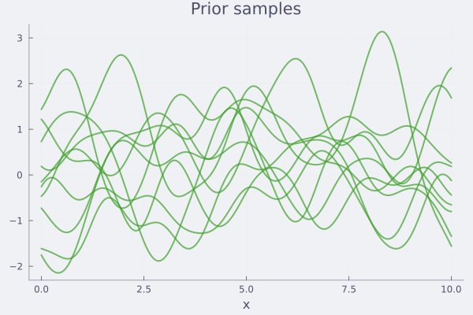


Now, suppose we have some data, likely with some noise. 

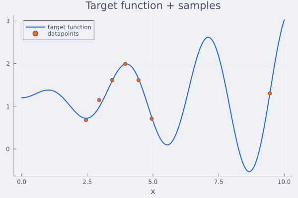

Can we condition the random functions to pass through this data? This can be done by using Bayes' rule for MVN:

Prior `x ∼ N(μ, Σ)`, observation `y = Ax + ε`, `ε ∼ N(0, Γ)`.

**Posterior** `x | y ∼ N(μ_post, Σ_post)`:

$$\mu_{\text{post}} = \mu + \Sigma A^\top(A\Sigma A^\top + \Gamma)^{-1}(y - A\mu)$$

$$\Sigma_{\text{post}} = \Sigma - \Sigma A^\top(A\Sigma A^\top + \Gamma)^{-1} A\Sigma$$

**Marginal of `y`** (useful for likelihood):

$$y \sim N(A\mu,\; A\Sigma A^\top + \Gamma)$$


So, using the matrix $A$, we can condition on (noisy) observations, or linear constraints in general. In practice for the example functions, we obtain.

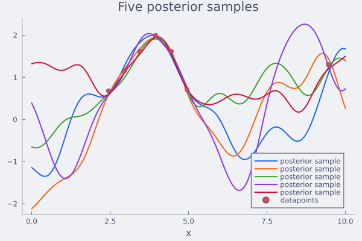

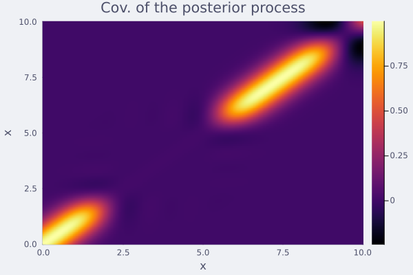

This all works well and is easy to implement. It scales well up to thousands of data points or linear constraints in general. Up to now, this has all been textbook. We summarize this (in 2D) in the figures below. 

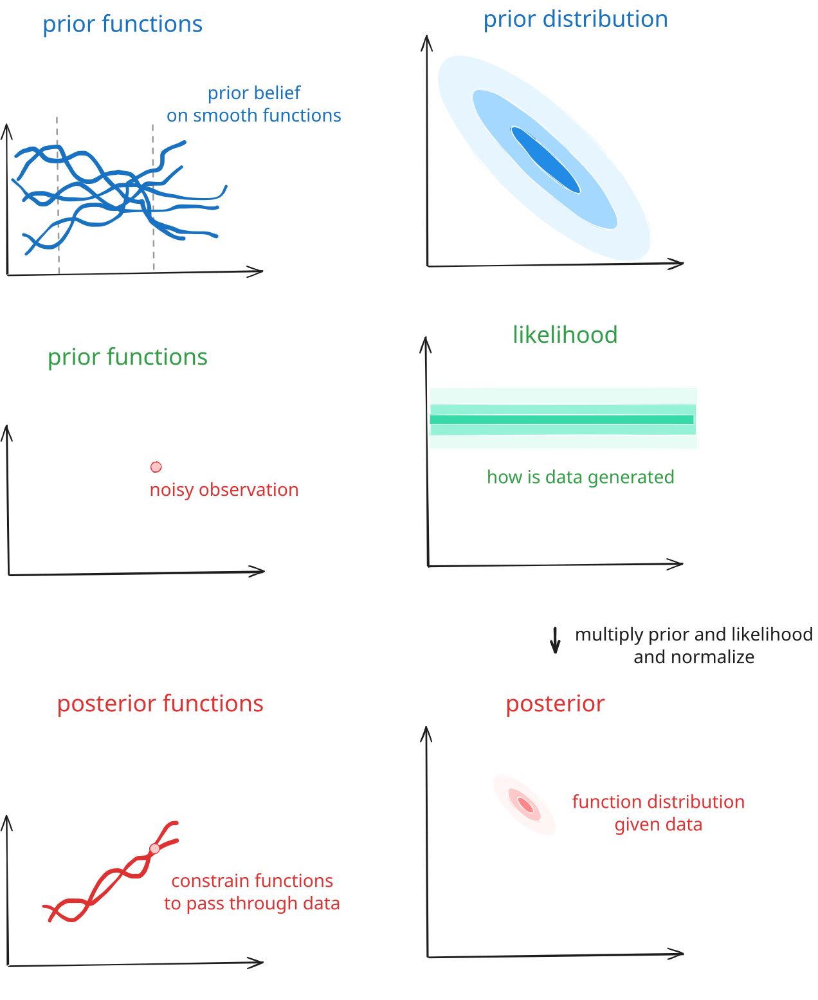

Because GPs are basically MVN distributions and the normal distribution is conjugate, conditioning on a Gaussian likelihood keeps the GP Gaussian, making the mathematics tractable.

The paper discusses how to incorporate additional constraints, which are encoded as non-Gaussian PDFs. For example, if we want to condition the function $f$ to be positive, we can use a distribution that assigns no probability density to any point where any of the elements are negative, as shown below.

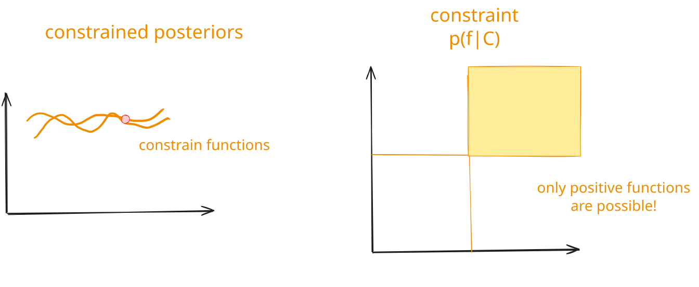

Traditionally, such extensions were solved by approximations. Either one approximates the problem using a local (Laplace approximation) or global (variational inference) approximation, or one uses Markov chain Monte Carlo to sample from intractable distributions. The paper here provides a new point of view to do this: diffusion.

## Gaussian processes as diffusion models

In the paper, the authors frame a GP sample as a [diffusion model](https://en.wikipedia.org/wiki/Diffusion_model). The forward process assumes a sample ${f}_0$ and keeps adding noise to it to obtain ${f}_1\sim N(0, I)$. Diffusion models learn the inverse map, where one starts from a noise sample $\mathbf{z}\sim N(0, I)$ and one adds model-guided noise to obtain a sample of the target distribution (e.g., an image of an [avocado armchair](https://www.technologyreview.com/2021/01/05/1015754/avocado-armchair-future-ai-openai-deep-learning-nlp-gpt3-computer-vision-common-sense/)).

For Gaussian processes, the denoising process can be seen as simulating a stochastic differential equation, which can be generated by numerically integrating the following ODE, departing from a random sample:

$$\frac{df_t}{dt} = -\tfrac{1}{2}\beta(t)\big(f_t + s(f_t,t)\big)$$

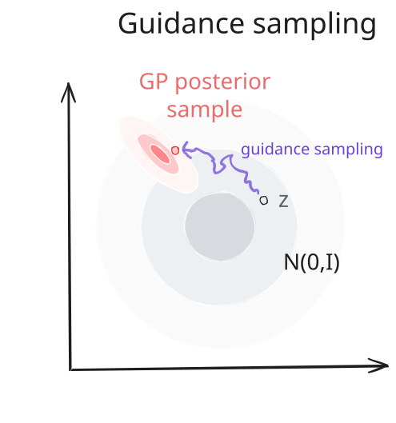

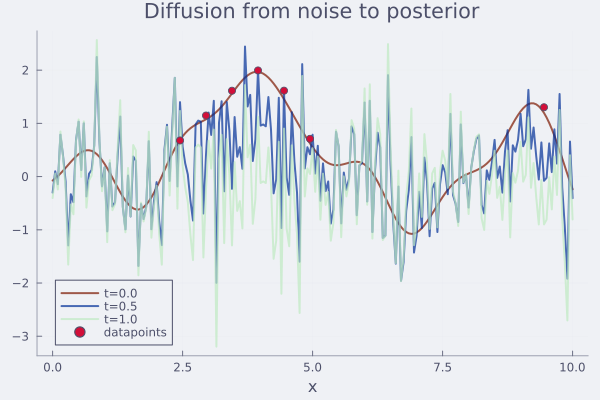

Here, $\beta(t)$ is related to the process of how noise is added. For a vanilla GP, the guidance function $s(f_t,t)$ is fully determined by the GP. One can actually analytically solve the ODE. Things become more interesting when trying to guide with a non-Gaussian PDF $p(C\mid {f})$, for which the guide is the gradient of the log-likelihood:

$$s(f_t,t) = \nabla_{f_t}\log p(C\mid f_t, D)\,.$$

Two tricks the authors develop to make this work:

* This gradient is, in general, not possible to evaluate, as we need to condition also on D. To this end, the authors take some Monte Carlo estimates (five suffice, but it works with even a single one) of the GP and create a self-normalised importance estimator.
* Using diffusion for $p(D\mid f_0)$ and $p(C\mid f_0)$ makes the problem stiff. Before denoising, the authors whiten the sample, i.e., remove the GP posterior signal. The diffusion is done in whitened space, and at the end, they transform back. This greatly improves the structure of the denoising problem, making it rather insensitive to the specific hyperparameter settings (which I could confirm experimentally)!

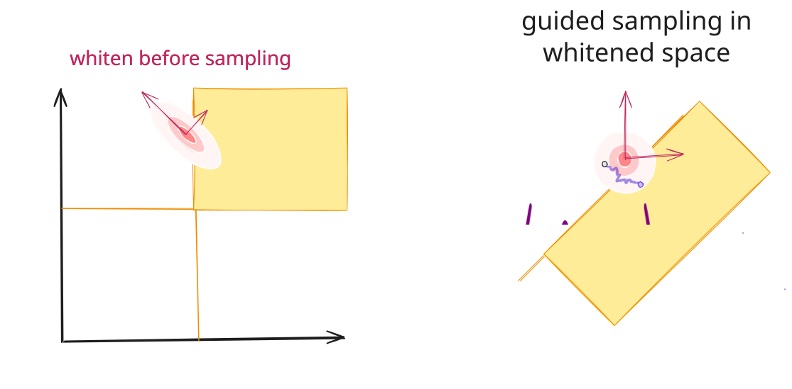

The full code for a basic implementation is given below

```julia
"""
	sample_conditional(m, K, log_p_C; kwargs)

Conditions a sample of a GP with mean `m` and covariance `K`
according to log-likelihood constraint `log_p_C`.

"""
function sample_conditional(m, K, log_p_C;
			S=5,                 # number of Monte Carlo samples for gradient
			n_euler=100,         # number of Euler steps
			jitter=1e-10,        # jitter for Cholesky decomposition
			v_max=100)           # vmax for gradient clipping
	n = length(m)
	# random perturbations
	Z = randn(n, S)  # share always the same noise for each step
	f̂ = randn(n)
	F_samples = similar(Z)
	# stuff for whitening
	C = cholesky(Symmetric(K + jitter*I))
	L = C.L 
	# define log_p_C and its gradient on whitened vector 
	log_p_C_whitened = f̂ -> log_p_C(L * f̂ .+ m)
	∇log_p_C_whitened = f̂ -> ForwardDiff.gradient(log_p_C_whitened, f̂)
	s = zeros(n)  # gradient for conditioning
	# euler steps
	tsteps = range(1, 0, length=n_euler)
	for t in tsteps
		αₜ = α(t)  # drift coefficient
		σₜ = √(1 - αₜ^2)
		# sample in whitened space
		F_samples .= αₜ .* f̂ .+ σₜ .* Z
		# compute gradient using MC
		ℓ = [log_p_C_whitened(F_samples[:,i]) for i in 1:S]
		# turn in weights (log-sum-exp trick)
		w = exp.(ℓ .- logsumexp(ℓ))
		s .= 0.0
		for (i, wᵢ) in enumerate(w)
			s .+= ∇log_p_C_whitened(F_samples[:,i]) * w[i]
		end
		s .*= - β(t) * αₜ / 2
		smooth_clip!(s; v_max)   # soft clip the gradients
		# update
		f̂ .+= s * step(tsteps)
	end
	# unwhiten
	f̂ .= L * f̂ .+ m
	return f̂	
end
```
## Conditioning in practice

Let us try some examples. Suppose we want to condition our posterior to be positive. This can be realised by picking a log-PDF that returns very low values when elements of $f$ are negative:

```julia
log_p_C(f₀; ν=1e-3) = sum(logerfc.(-(f₀ ./ ν) ./ sqrt(2)))
```

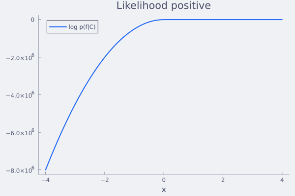

Using the wonder of automatic differentiation, this is the only thing we need to specify! So this works:

```julia
f̂ = sample_conditional(m_cond_y, K_cond_y, log_p_C)
```

Taking a sample takes a bit less than 500 ms on my machine (my code has great potential for optimisation).

```
BenchmarkTools.Trial: 20 samples with 1 evaluation per sample.
 Range (min … max):  239.502 ms … 348.179 ms  ┊ GC (min … max): 6.19% … 31.50%
 Time  (median):     245.681 ms               ┊ GC (median):    6.65%
 Time  (mean ± σ):   260.413 ms ±  28.139 ms  ┊ GC (mean ± σ):  9.11% ±  6.85%

  █▄▁▁            ▁       ▁                                      
  ████▁▁▆▁▁▁▁▁▁▆▆▁█▁▁▁▁▁▁▁█▁▁▁▁▁▁▁▁▁▁▁▁▁▁▆▁▁▁▁▁▁▁▁▁▁▁▁▁▁▁▁▁▁▁▁▆ ▁
  240 ms           Histogram: frequency by time          348 ms <

 Memory estimate: 1019.66 MiB, allocs estimate: 141725.
 ```

 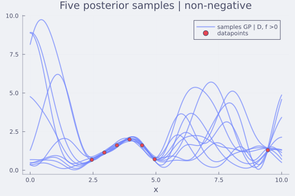

You see that these are very reasonable posteriors and all satisfy the constraints.

## Simple classification

Classification using Gaussian processes is a classical problem that normally requires some tinkering. For binary classification, the idea is to constrain the function $f$ such that, if we apply the logistic map $\sigma(f)$, one obtains class probabilities conditioned on the data via cross-entropy. This framework incorporates this naturally.

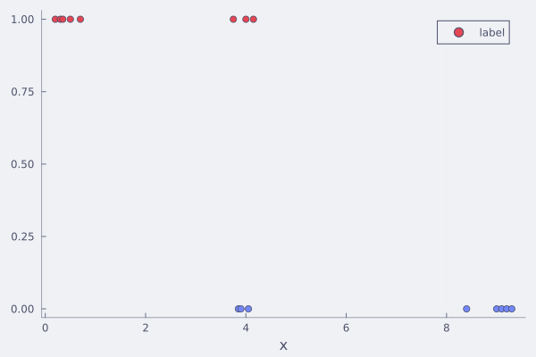

```julia
# cross-entropy on σ(f)
function log_C_clf(f)
	σ = fi -> 1 / (1 + exp(-fi))
	return sum(ti ? log(σ(f[i])) : log(1-σ(f[i])) for (i, ti) in zip(Iclf, targetclf))
end
```

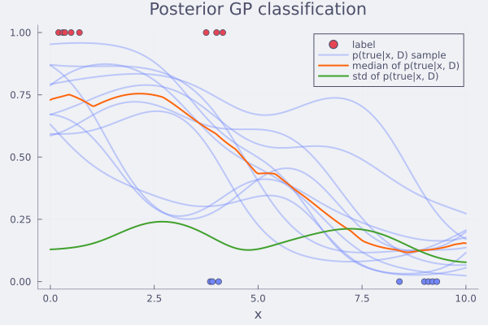

For this toy example, you see that we can get samples from the GP prior where $f$ are probits of the class probabilities. Such a Bayesian classifier is very useful, for example, in Bayesian optimisation with binary labels (e.g., designing proteins that are active or not), where one has to separate uncertainty between aleatoric (due to irreducible noise and fuzzy class boundaries) and epistemic (due to an incomplete model) uncertainty (Fauvel & Chalk, 2021).


## Guiding towards other properties

Using the same logic, one can constrain the functions to be monotonously increasing.

```julia
function log_p_monotone(f; ν=1e-3)
    Δ = diff(f)                     # discrete derivative
    return sum(logcdf(STDNORMAL, Δ ./ ν))
end
```

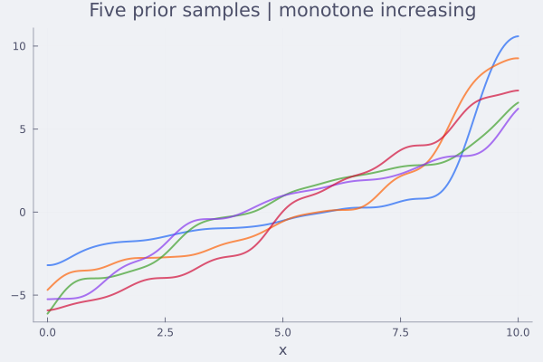

convex

```julia
function log_p_convex(f; ν=1e-3)
    # Second differences: f[i+1] - 2f[i] + f[i-1] ≥ 0 for convexity
    Δ² = f[1:end-2] .- 2 .* f[2:end-1] .+ f[3:end]
    return sum(logerfc.(.-Δ² ./ (ν * sqrt(2))))
end
```

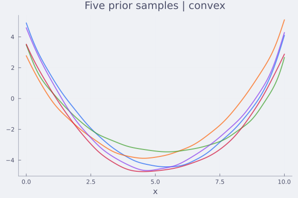

or a combination

```julia
log_p_monotone_convex(t) = log_p_convex(t) + log_p_monotone(t)
```

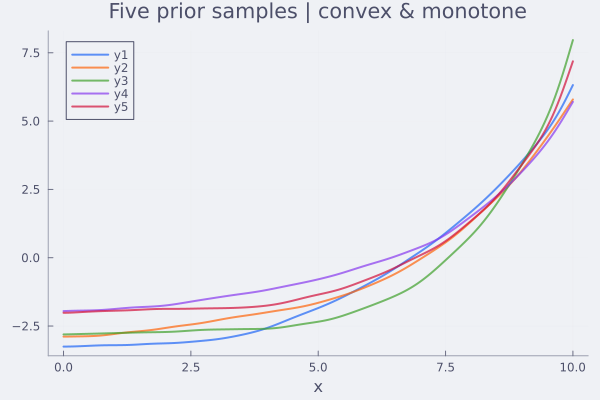

## Potential and conclusions

I enjoyed reading this paper and playing around with the ideas. The mathematical foundation is elegant and broad in scope, and it is surprisingly easy to get working in practice with very little tuning. My code could work for any constraint, thanks to autodiff, though it will need some speedup to scale to larger problems.

This work greatly extends and simplifies Bayesian and probabilistic modelling using Gaussian processes, without resorting to specific tricks such as variational inference. Constraints, physical laws, mechanistic structure, i.e., anything you can write down as a scoring function $\log p(C \mid f)$. It composes multiplicatively without needing specific inference schemes.

What the authors briefly explore (and is almost certainly grounds for future research) is conditioning on LLM outputs, using them to encode imprecise or hard-to-quantify information. For example, it would be worthwhile in domains such as protein engineering with sparse experimental activity data and prior knowledge incorporated in foundation models. Here, a model such as ESMFold can serve as a prior for biological plausibility, which can be combined with experimental data in a Bayesian framework.

It is also worth being realistic about what FLOWGP does *not* do. It samples function-space posteriors but does not jointly infer the parameters of the dynamics generating those functions. In the physics examples, the equation coefficients are assumed known, which is not what one usually means by "physics-informed ML". It also inherits the $O(m^3)$ scaling of exact GPs and offers no escape from this bottleneck at large discretisations. The theoretical guarantees are clean for log-concave likelihoods (classification, Poisson, convex constraints), but only worst-case bounds apply to non-log-concave cases such as nonlinear physics residuals or LLM-derived densities, where the method works empirically. And "condition on anything" is more precisely "condition on anything one can score": writing down a likelihood for a verbal description or a structural intuition is often itself the hard problem, and FLOWGP does not help with that step.

FLOWGP is a meaningful addition to the GP toolkit rather than a replacement for the broader Bayesian inference machinery. The cases where it fits cleanly come up often enough that the implementation effort is genuinely worth it.


## References

Moss, H., Astfalck, L., Cowperthwaite, T., Doumont, C., Willis, S., Hennig, P., Nemeth, C., Zammit-Mangion, A., 2026. Conditioning Gaussian Processes on Almost Anything. https://doi.org/10.48550/arXiv.2605.21041

Fauvel, T., Chalk, M., 2021. Efficient exploration in binary and preferential Bayesian optimization. arXiv.


---

[^1]: The number of dimensions does not matter, not the exact nature of the space, but let us keep it 1D Euclidean for the sake of simplicity.
