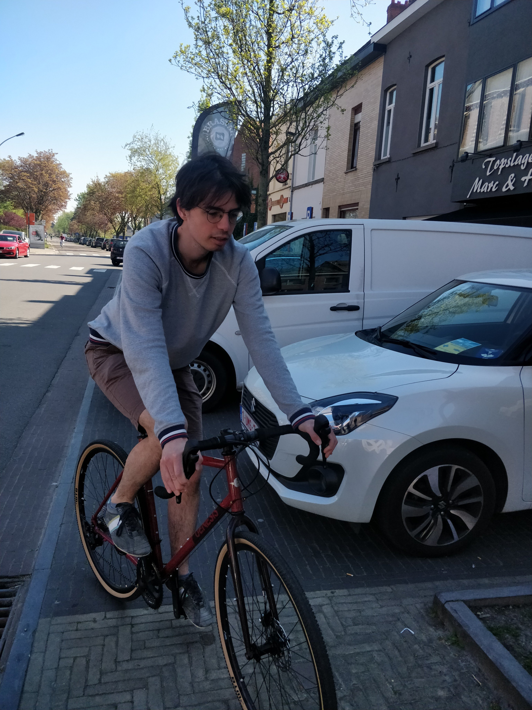

@def title = "Maximum Entropy"

# Maximum Entropy

Hi, I am Michiel Stock, a postdoctoral researcher at Ghent University.
I am interested in applying computational intelligence to modelling and engineering in the life sciences.
During my PhD, I worked on kernel-based methods to model interactions.
Afterwards, I spend a couple of years on modelling species interaction networks.
Now, my main focus is on stochastical modelling and operations research for synthetic biology.

In my spare time, I enjoy reading, running, and boardgames. I am also following training to become a chef.

## Contact

~~~
<head>
<link rel="stylesheet" href="https://maxcdn.bootstrapcdn.com/font-awesome/4.4.0/css/font-awesome.min.css">
</head>
<body>
<a href="https://twitter.com/michielstock"><i class="fa fa-twitter"></i></a> bird
  
<a href="https://github.com/MichielStock/"><i class="fa fa-github"></i></a> github
</body>
~~~

[📧](mailto:michielfmstock@gmail.com) mail

[📚](https://www.goodreads.com/user/show/4249244-michiel) books

[👨‍🏫](https://speakerdeck.com/michielstock) talks
