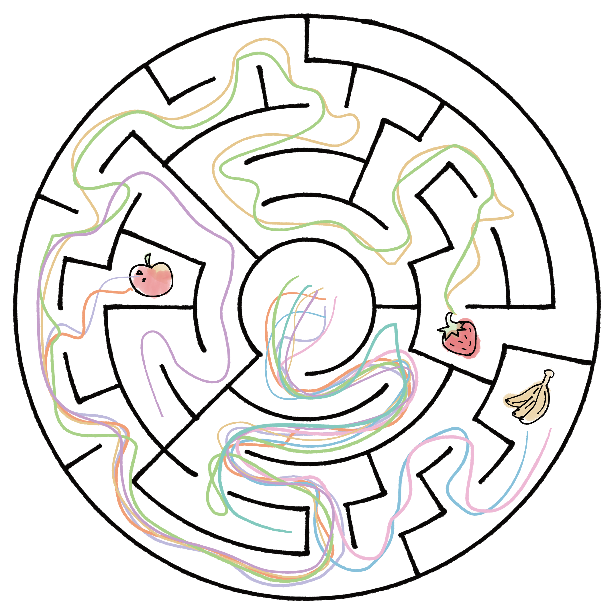
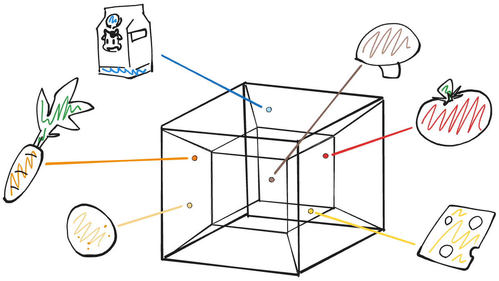
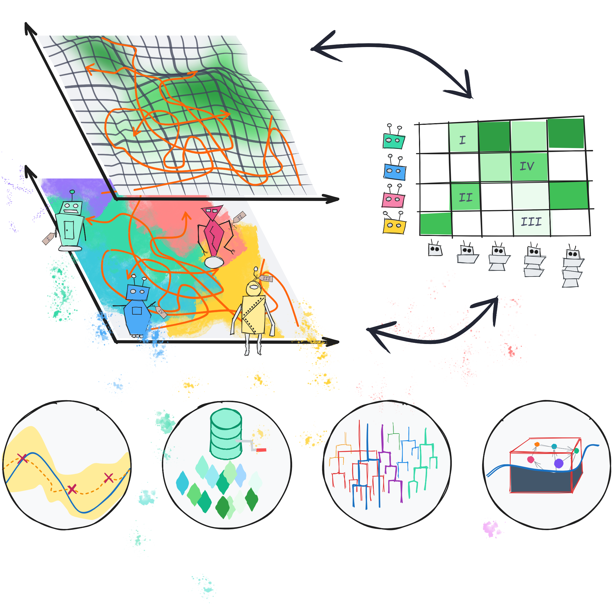
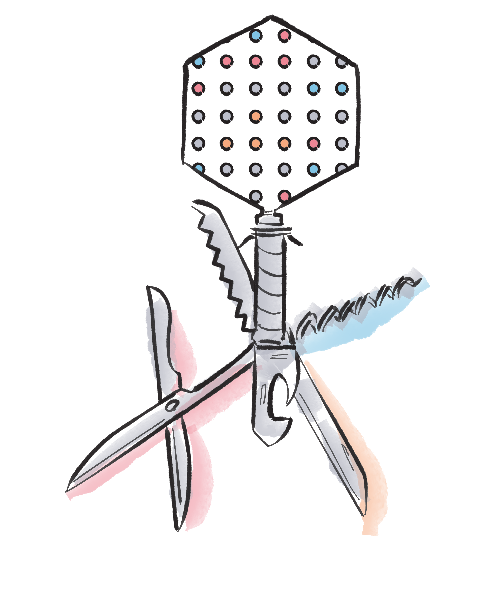
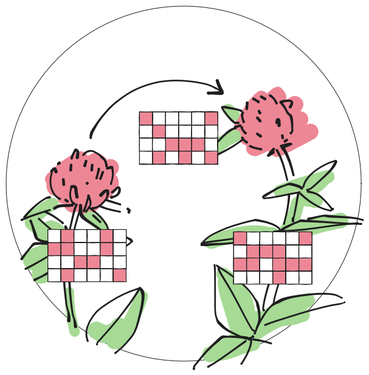

::: {.hero-section}

{.hero-image fig-alt="Michiel Stock, assistant professor at Ghent University"}

::: {.hero-text}
# Michiel Stock

[Assistant Professor · Ghent University · Faculty of Bioscience Engineering]{.subtitle}

I develop computational intelligence methods to model and engineer biological
systems. I co-lead the [KERMIT](https://kermit.ugent.be/) research unit, where
we use machine learning, simulation, mathematical optimization, and evolutionary
computing to understand life — from molecular interactions to ecological networks.

::: {.hero-links}
[ Email](mailto:michiel.stock@ugent.be)
[ GitHub](https://github.com/MichielStock)
[ Scholar](https://scholar.google.be/citations?user=qR_LXM8AAAAJ)
[ Goodreads](https://www.goodreads.com/user/show/4249244-michiel)
[ Talks](https://speakerdeck.com/michielstock)
:::

:::

:::

---

## Recent Posts

:::{#recent-posts}
:::

[See all posts →](blog/index.qmd)

## Selected Publications

::: {.pub-card}
:::: {.pub-card-inner}
{.pub-thumb}

::::: {.pub-card-text}
[**Open-endedness in synthetic biology: A route to continual innovation for biological design**]{.pub-title}

[M. Stock, T. E. Gorochowski]{.pub-authors}

[Science Advances, 10, eadi3621 (2024)]{.pub-venue}

::: {.pub-links}
[Paper](https://www.science.org/doi/10.1126/sciadv.adi3621)
:::
:::::
::::
:::

::: {.pub-card}
:::: {.pub-card-inner}
{.pub-thumb}

::::: {.pub-card-text}
[**Hyperdimensional computing: a fast, robust and interpretable paradigm for biological data**]{.pub-title}

[M. Stock, W. Van Criekinge, D. Boeckaerts, P. Dewulf, S. Taelman, M. Van Haeverbeke, B. De Baets]{.pub-authors}

[PLOS Computational Biology, 20, e1012426 (2024)]{.pub-venue}

::: {.pub-links}
[Paper](https://journals.plos.org/ploscompbiol/article?id=10.1371/journal.pcbi.1012426)
:::
:::::
::::
:::

::: {.pub-card}
:::: {.pub-card-inner}
{.pub-thumb}

::::: {.pub-card-text}
[**Quality-diversity methods for the modern data scientist**]{.pub-title}

[M. Stock, D. Van Hauwermeiren, B. De Baets, S. Taelman, D. Marzougui, M. Van Haeverbeke]{.pub-authors}

[WIREs Computational Statistics, 17, e70047 (2025)]{.pub-venue}

::: {.pub-links}
[Paper](https://doi.org/10.1002/wics.70047)
:::
:::::
::::
:::

::: {.pub-card}
:::: {.pub-card-inner}
{.pub-thumb}

::::: {.pub-card-text}
[**Prediction of Klebsiella phage-host specificity at the strain level**]{.pub-title}

[D. Boeckaerts, M. Stock, C. Ferriol-González, J. Oteo-Iglesias, R. Sanjuán, P. Domingo-Calap, B. De Baets, Y. Briers]{.pub-authors}

[Nature Communications, 15, 4355 (2024)]{.pub-venue}

::: {.pub-links}
[Paper](https://doi.org/10.1038/s41467-024-48675-6)
:::
:::::
::::
:::

::: {.pub-card}
:::: {.pub-card-inner}
{.pub-thumb}

::::: {.pub-card-text}
[**Optimal transportation theory for species interaction networks**]{.pub-title}

[M. Stock, T. Poisot, B. De Baets]{.pub-authors}

[Ecology and Evolution, 11, 3841–3855 (2021)]{.pub-venue}

::: {.pub-links}
[Paper](https://onlinelibrary.wiley.com/doi/abs/10.1002/ece3.7254)
:::
:::::
::::
:::

::: {.pub-card}
:::: {.pub-card-inner}
{.pub-thumb}

::::: {.pub-card-text}
[**Plant science in the age of simulation intelligence**]{.pub-title}

[M. Stock, O. Pieters, T. De Swaef, F. Wyffels]{.pub-authors}

[Frontiers in Plant Science, 14, 1299208 (2024)]{.pub-venue}

::: {.pub-links}
[Paper](https://www.frontiersin.org/articles/10.3389/fpls.2023.1299208/full)
:::
:::::
::::
:::

[See all publications →](research.qmd)
